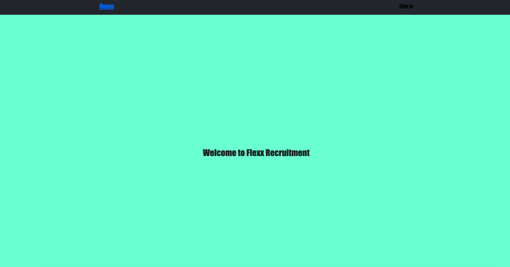

# Getting Started with Create React App

## Authur : Jude OKAGU

## `npm i`

## `npm start`

```
Runs the app in the development mode.\
Open [http://localhost:3000](http://localhost:3000) to view it in your browser.

```

### Project Description

```
Full stack application which where employees can log in with google auth and fill in name, position and hours worked

```

### Status

### MVP COMPLETED

### Frame work used

### Ract.js + Firebase

### App Image landing page



### FIREBASE Deployed Link

[Deployed Link](https://e-comm-6609c.web.app/)

### Treo Board Link

[Trello Board Link](https://trello.com/b/k0ReEM0o/e-commerce-full-stack-application)
